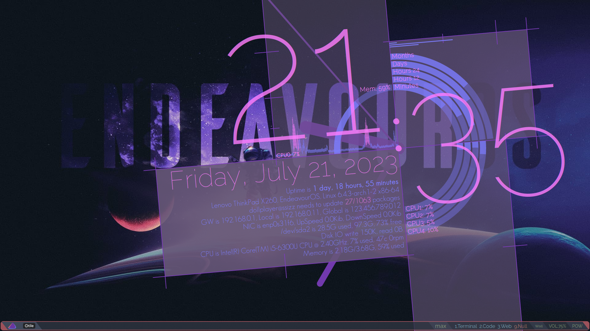
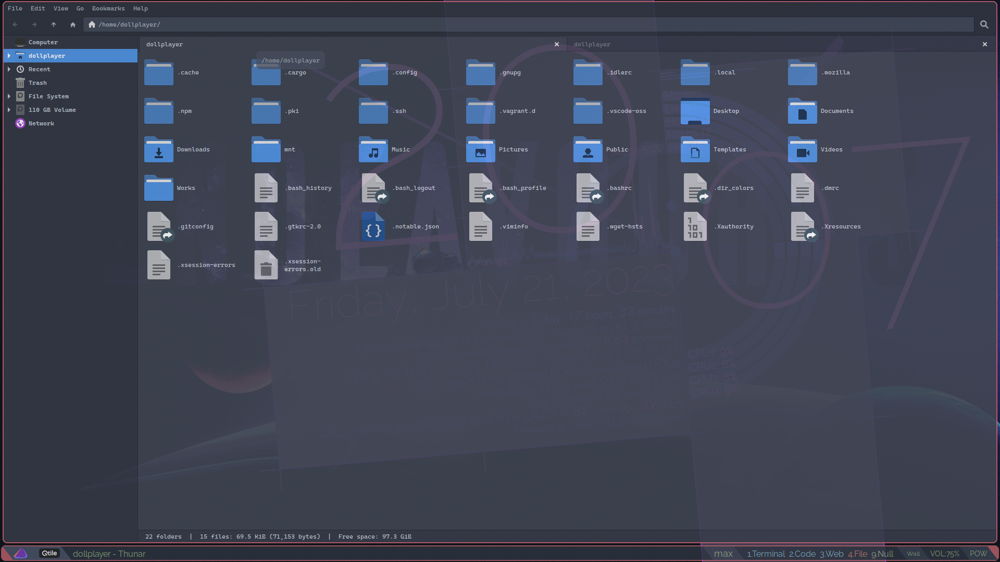
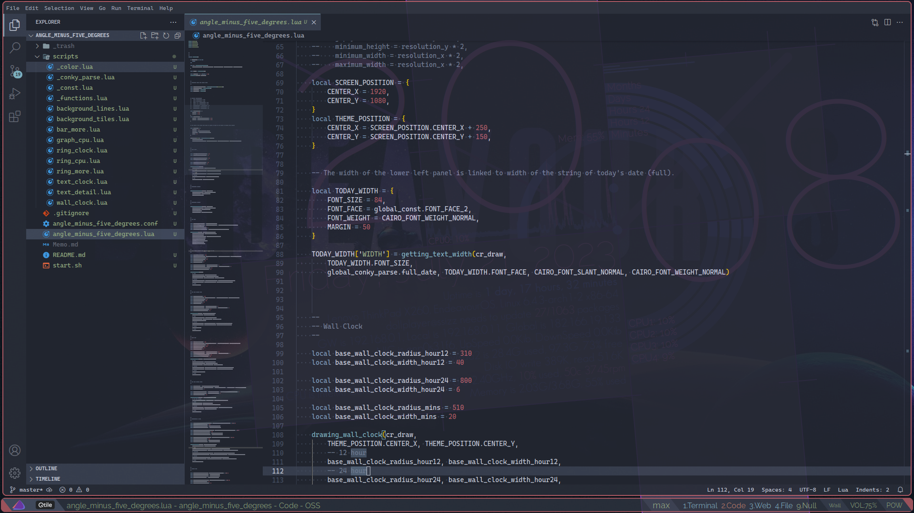
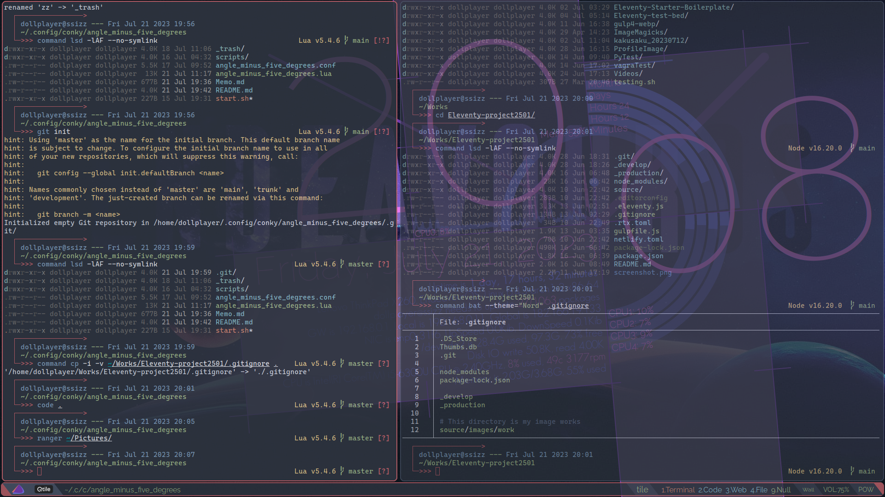

# Conky theme, "Angle minus five degrees"


<br clear="all" />





I created this unnecessarily large [Conky](https://github.com/brndnmtthws/conky) theme on the premise that "I only need to know current time".  
Because I mainly use terminal emulator and text editor with _transparent background_ in Linux desktop environment.  
So I thought, "I should use this vast space!".

- Linux distribution: [EndeavourOS](https://endeavouros.com/)
- Window manager: [Qtile](http://www.qtile.org/), [qtile-extras](https://qtile-extras.readthedocs.io/en/stable/#)
- Terminal emulator: [Alacritty](https://github.com/alacritty/alacritty)
- Text editor: [Code OSS](https://github.com/microsoft/vscode/) ~~with [GlassIt-VSC](https://marketplace.visualstudio.com/items?itemName=s-nlf-fh.glassit)~~
- Standalone compositor: [Picom](https://wiki.archlinux.org/title/Picom)

I created the theme based on the idea that "Every thing other than the time display is a decoration" likening Mobile Suit Gundam's "Legs are decorations".


## Requirements, operating conditions

1. This theme runs the following Linux commands via Lua's `conky_parse` and Conky's `execi`.  
   All these are put together in `./scripts/_conky_parse.lua`.
    - `lscpu`
    - `hostnamectl`
    - `uptime`
    - `whoami`
    - `hostname`
    - [`checkupdates`](https://man.archlinux.org/man/community/pacman-contrib/checkupdates.8.en)
    - `pacman -Q`
    - `wget -q -O - http://checkip.amazonaws.com/`  
      This is a global IP address.  
      If you don't want to display, you'll need to comment out and/or modify code.  
      See `global_ip` of `./scripts/_conky_parse.lua` and `./scripts/text_detail.lua`.
    - `wc`, `grep`
2. [`Geosans Light font`](https://aur.archlinux.org/packages/ttf-geosans-light), [`Ralewy font`](https://aur.archlinux.org/packages/ttf-raleway)
3. I am writing this code assuming **4 CPUs**.  
   If the number is other than this, it will be necessary to modify the this theme.
4. This theme's design is based on the assumption that the screen is FHD/Full High Definition, 1920x1080.


## Lanch order for this theme

Assuming everything is stored in `~/.config/conky/angle_minus_five_degrees/`.

1. `./start.sh`
2. `./angle_minus_five_degrees.conf`
3. Start `./angle_minus_five_degrees.lua` from `lua_load` in above script
4. `./scripts/*.lua` of above script, `require`


## Features not implemented

Functions that could not be implemented due to my lack of technical skills.

1. ~~Change character decoration in the middle of a sentence~~  
   Done, not implemented as a generalized parser, for this reason, it is a very unrefined implementation.   
   See. `./scripts/text_detail.lua`
2. Imprementing logarithmic graph, ex. Network Up/Down speed, Disk read/write.  
   I have no idea and skill...although I have a completely unique imprementation idea...
3. Imprementing display of currency rates.  
   Planned, may not be implemented. Use [pandas-datareader](https://pandas-datareader.readthedocs.io/en/latest/#)?
4. Show [`conky_parse("${top name n}")` and `conky_parse("${top cpu n}%")`](https://conky.cc/variables#top) in bottom right?  
   Because it is relatively easy to mix left and right justification on the same line.
5. Rewrite on the premise that [wim66/conky-system-lua-V3](https://github.com/wim66/conky-system-lua-V3) hoge's library is fully used?  
    - Network Up/Down speed implementation included.
    - Does not include an implementation of decoration changes in the middle of a string.
    - I want to separate the source code of the main body and the settings of each module from being described in the same file.


## Other notable matters

A few years...half a year later, for myself to review this scripts.

- Setting a virtual space that is twice the size of the displayed image.  
  See `./angle_minus_five_degrees.conf`
- Changing the center point in this theme is relatively easy to fix.  
  See `THEME_POSITION` of `./angle_minus_five_degrees.lua`
- The width of the lower left panel is linked to width of the string of today's date (full).
- Each module/scripts is/are using [`conky_parse('${updates}')`](https://conky.cc/variables#updates) to do some lazy processing.  
  Therefore, it takes time to start up completely.
- This theme color scheme is used [EndeavourOS colour palette](https://forum.endeavouros.com/t/colour-palette/3480).  
  See `./scripts/_color.lua`
- NIC, Network Interface Card is dynamically fetching using [`conky_parse('${iface}')`](https://conky.cc/variables#gw_iface) of `./scripts/_conky_parse.lua`.
- The file system name is written directory in `DISK_DEVICE` of `./scripts/_const.lua`, in my case `/dev/sda2`
- Since I am a native language other than English. For this reason, the sentences sutch as this `README.md` and comments in the source code may be strange.


## Appendix) How this theme interacts with tiling window managers

In my case, I use Qtile on EndeavourOS, so this is the premise.

### 1. In `~/.config/qtile/autostart.sh` write a call to the startup script for this theme below.

```
~/.config/conky/angle_minus_five_degrees/start.sh & disown
```

### 2. Add a screen that does't dare to do anything to Qtile's virtual screen.

In my case, `~/.config/qtile/modules/groups.py`.

```
groups = [
  Group('1', position = 1, init = True, persist = True, label = '1.Terminal', layout = 'tile', matches = [Match(wm_class = ['Alacritty'])],),
  Group('2', position = 2, init = False, persist = False, label = '2.Code', layout = 'max', matches = [Match(wm_class = ['code-oss'])],),
  Group('3', position = 3, init = False, persist = False, label = '3.Web', layout = 'max', matches = [Match(wm_class = ['firefox', 'brave-browser'])],),
    :
  Group('9', position = 9, init = True, persist = True, label = '9.Null', layout = 'max', ),
]
```

With this above, you can jump to a virtual screen for the purpose of not display any application with **Mod + 9**.  
And I don't dare to use Qtile's [`libqtile.widget.Clock()`](https://docs.qtile.org/en/stable/manual/ref/widgets.html?highlight=time#clock)...I don't care.


### 3. Applications that are always used perform transparent processing with the configuration of the applications or Picom.


### 4. For the above...

The terminal and text editor that I mainly use always show the current time transparently (or I look directory at the watch/clock), and if I want to know other information, I can get various information with **Mod + 9**.


//
