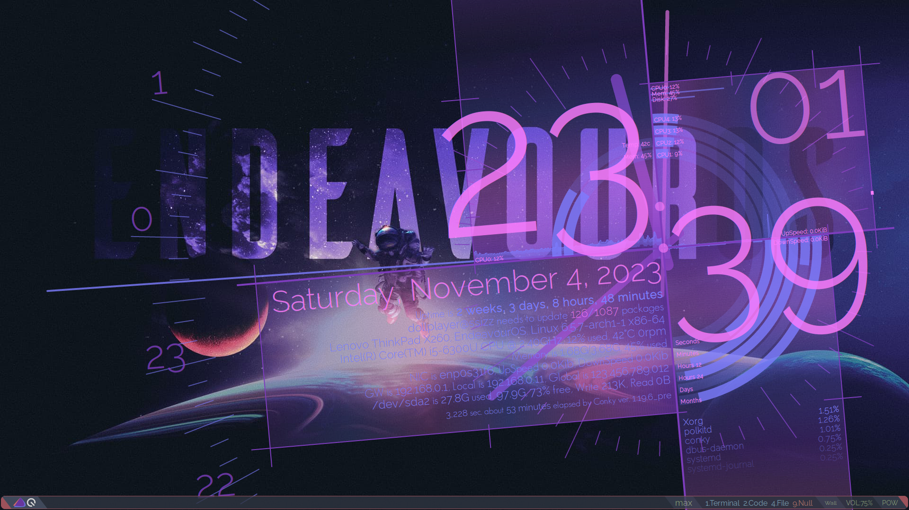
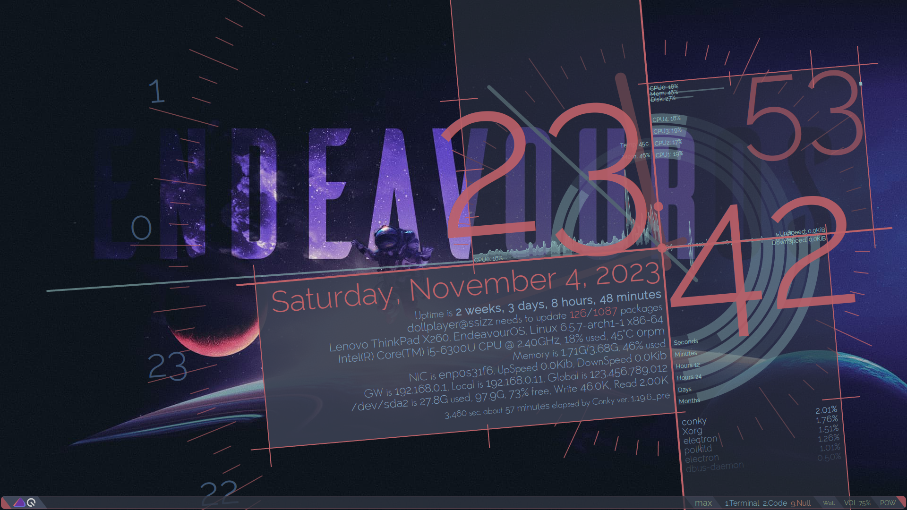
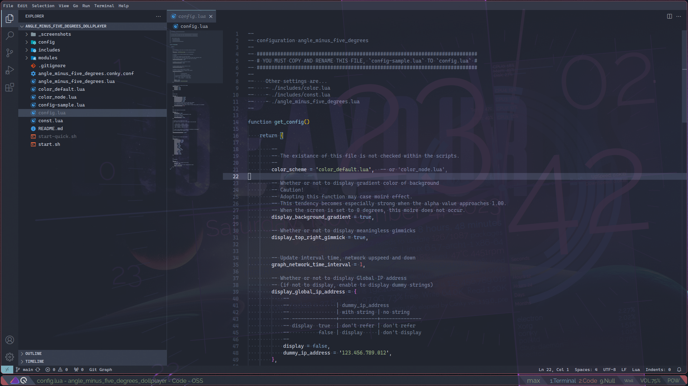
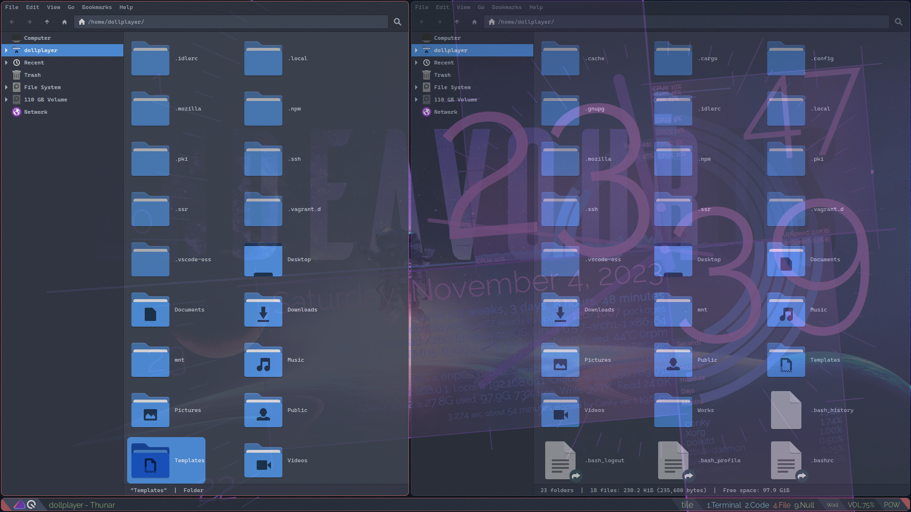

# Conky theme, "Angle minus five degrees"

<table border="0">
<tr>
  <td style="vertical-align:top;text-align:right;">
     
    
  </td>
  <td style="vertical-align:top;text-align:left;">
     
     
    
  </td>
</tr>
</table>

I created this unnecessarily large [Conky](https://github.com/brndnmtthws/conky) theme on the premise that "I only need to know current time".  
Because I mainly use terminal emulator and text editor with _transparent background_ in Linux desktop environment.  
So I thought, "I should use this vast space!", and created the theme based on the idea that "Every thing other than the current time display is a decoration" likening Mobile Suit Gundam, "Legs are decorations".

- Linux distribution: [EndeavourOS](https://endeavouros.com/)
- Window manager: [Qtile](http://www.qtile.org/), [qtile-extras](https://qtile-extras.readthedocs.io/en/stable/#)
- Terminal emulator: [Alacritty](https://github.com/alacritty/alacritty)
- Text editor: [Code OSS](https://github.com/microsoft/vscode/) ~~with [GlassIt-VSC](https://marketplace.visualstudio.com/items?itemName=s-nlf-fh.glassit)~~
- Standalone compositor: [Picom](https://wiki.archlinux.org/title/Picom)
- Hardware: [ThinkPad X260](https://www.thinkwiki.org/wiki/Category:X260)

> [!IMPORTANT]
> FIRST, YOU MUST COPY AND RENAME `./config-sample.lua` TO `./config.lua`, IF YOU WANT TO USE THIS THEME.

## Requirements, operating conditions

1. This theme runs the following Linux commands via Lua's `conky_parse` and Conky's `execi`.  
   All these are put together in `./includes/conky_parse.lua`.
    - `lscpu`
    - `hostnamectl`
    - `uptime`
    - `whoami`
    - `hostname`
    - [`checkupdates`](https://man.archlinux.org/man/community/pacman-contrib/checkupdates.8.en)
    - `pacman -Q`
    - `wget -q -O - http://checkip.amazonaws.com/`  
      This is to get global IP address. If you don't want to display, you'll need to check `display_global_ip_address` at `./config.lua`.
    - `wc`, `grep`
1. The following fonts are used.
    - [`Geosans Light font`](https://aur.archlinux.org/packages/ttf-geosans-light)
    - [`Ralewy font`](https://aur.archlinux.org/packages/ttf-raleway)
1. I am writing this code assuming **4 CPUs**.  
   If the number is other than this, it will be necessary to modify the this theme.
1. This theme's design is based on the assumption that the screen is FHD/Full High Definition, 1920x1080.

## Lanch order for this theme

Assuming everything is stored in `~/.config/conky/angle_minus_five_degrees/`.

1. `./start.sh`
1. `./angle_minus_five_degrees.conky.conf`
1. `./angle_minus_five_degrees.lua`
    1. `./config.lua`, `./const.lua`
    1. `./includes/functions.lua`, `./includes/conky_parse.lua`
    1. `./config/*.lua`, `./modules/*.lua`
    1. `./color_default.lua` (default setting)

## Other information?

I plan to add it to this repository's [Wiki](https://github.com/dollplayer2501/angle_minus_five_degrees/wiki) from time to time...

//
